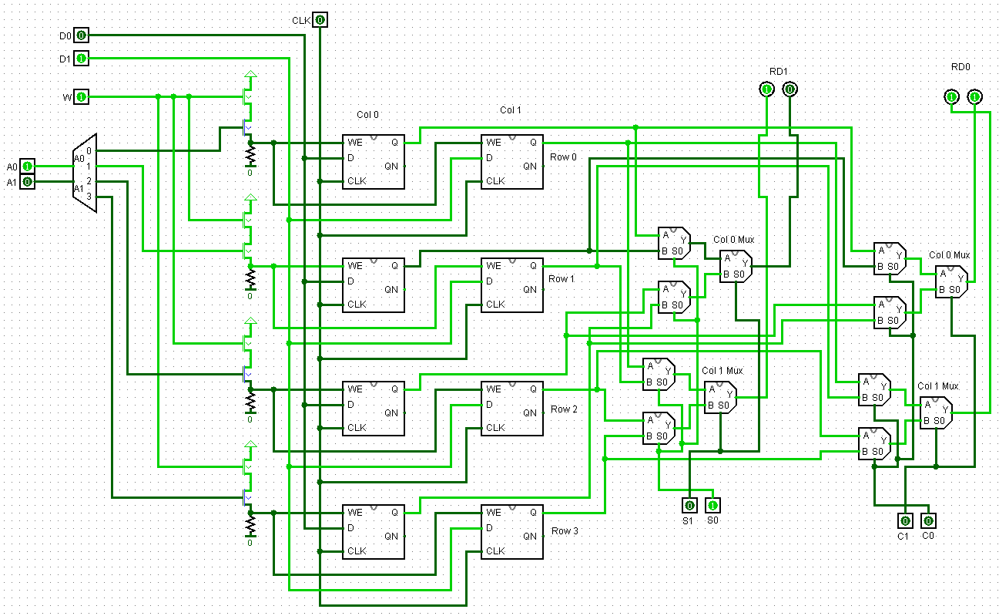
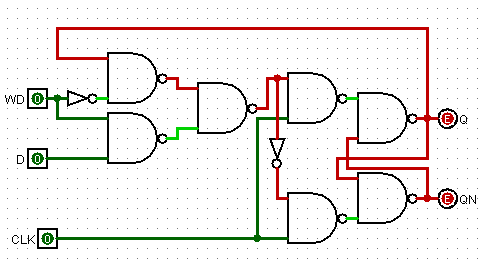
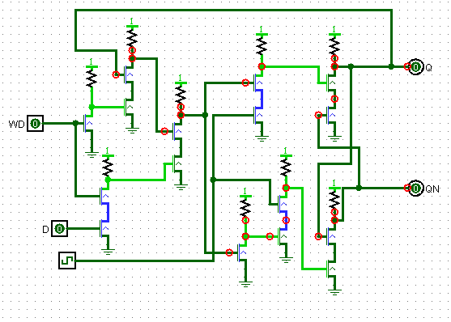
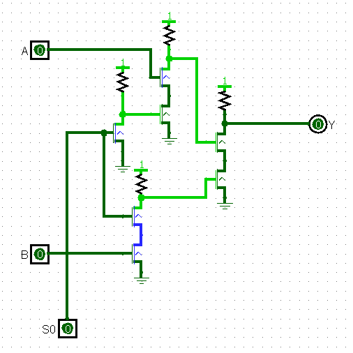
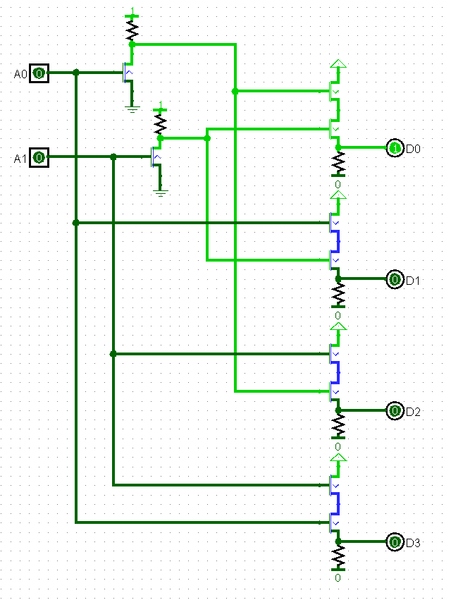

# Register file

Register file: 4 2bit writable registers
> (Custom circuits, transistors only)
>

D flip-flop with enable bit: "1 bit register"
>

NPN transistor equivalent using pull-up resistors
>

2x1 Mux
>

2x4 Decoder
>
